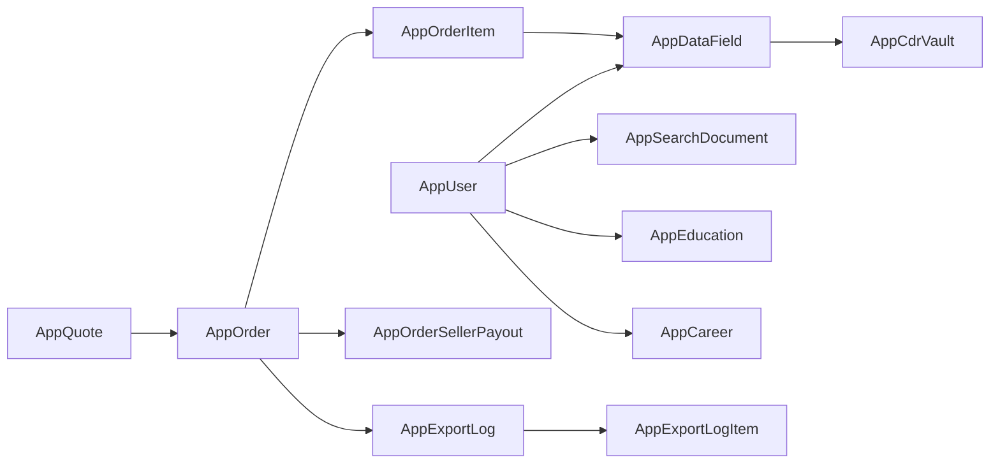
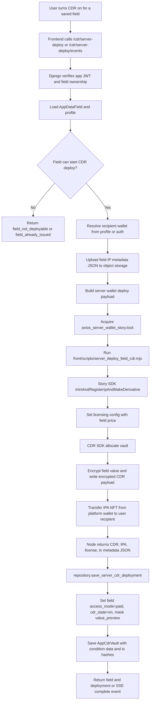
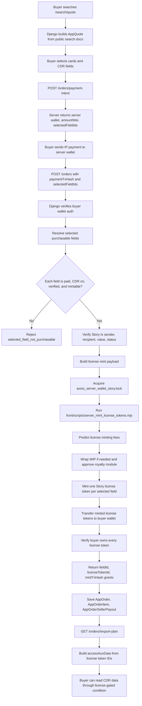

# AXIOS Django Server

AXIOS Django server는 프론트엔드의 사용자 프로필, 공개 검색, CDR 배포, 데이터 액세스 주문을 처리하는 API 서버다. Django는 인증, 검증, DB 저장, 서버 지갑 서브프로세스 실행을 담당하고, Story Protocol과 CDR SDK의 실제 on-chain write는 `front/scripts/*.mjs` Node 스크립트가 수행한다.

## Quick Start

```bash
cp .env.example .env
source ../.venv/bin/activate
python manage.py migrate
python manage.py runserver
```

`manage.py runserver` binds to `0.0.0.0:8001`.
The frontend API client uses `http://localhost:8001`.

## Runtime Entry

- `manage.py`: Django command runner.
- `main/settings.py`: `.env`와 루트 `.env`를 읽고 SQLite DB를 설정한다.
- `main/urls.py`: 전체 API route를 연결한다.
- `main/views.py`: 공통 JSON 응답, 인증 데코레이터, 검증 helper, CDR API proxy를 제공한다.
- `main/auth.py`: Privy session을 앱 JWT로 교환하고 앱 JWT를 검증한다.
- `main/errors.py`: API 에러 타입을 정의한다.

## App Layout

```text
django_server/
  main/
    settings.py       # Django settings, env loader, installed apps
    urls.py           # API route table
    views.py          # common API wrappers, auth guards, CDR proxy
    auth.py           # Privy token exchange and app JWT verification
    constants.py      # chain, contract, pricing, field constants
  users/
    views.py          # auth exchange, profile, wallet, avatar endpoints
    repository.py     # AppUser, education, career persistence
    models.py         # user profile tables
  data/
    views.py          # fields, verification, search, orders, exports
    repository.py     # main persistence layer and DTO mapping
    search.py         # quote/filter matching and quote extension
    orders.py         # payment verification, license minting, order creation
    integrations.py   # object storage, verification providers, server wallet subprocesses
    models.py         # fields, search docs, quotes, orders, exports
  onchain/
    views.py          # CDR deploy/toggle/sales endpoints
    repository.py     # re-export of data repository CDR helpers
    license_verification.py
```

## Request Boundary

Most mutating endpoints use this stack:

1. `@api_endpoint` catches typed errors and returns JSON.
2. `@authenticated` requires `Authorization: Bearer <app_jwt>`.
3. `parse_json` and `require_keys` validate the request body.
4. `assert_profile_auth`, `assert_field_auth`, or `assert_wallet_auth` checks ownership.
5. `repository` persists canonical Django models and returns frontend DTOs.

## Main API Groups

| Group | Endpoints | Purpose |
| --- | --- | --- |
| Health | `GET /health` | service health check |
| Auth/User | `POST /auth/privy/exchange`, `GET/POST /profiles`, `GET /profiles/me`, `POST /users/wallet` | Privy auth exchange, profile CRUD, wallet binding |
| Fields | `GET /profiles/<id>/fields`, `POST /fields`, `POST /verify/start`, `POST /verify/confirm` | user data field creation and verification |
| CDR | `POST /uploads/field-ip-metadata`, `POST /cdr/server-deploy`, `GET /cdr/server-deploy/events`, `POST /cdr/toggle` | metadata upload, server wallet CDR deployment, listing toggle |
| Search | `POST /search/quote`, `GET /search/requests`, `GET /search/requests/<id>`, `POST /search/requests/<id>/extend` | anonymous quote and saved search request flow |
| Orders | `POST /orders/payment-intent`, `GET/POST /orders`, `GET /orders/<id>/export-plan`, `POST /orders/<id>/export-log` | payment intent, access license minting, export tracking |
| Sales | `GET /sales` | server-saved sales plus on-chain sales logs |
| Public card | `GET /c/<slug>` | public profile card payload |
| CDR proxy | `GET /cdr-api/<allowed-path>` | restricted proxy to external CDR API paths |

## Core Data Model



- `AppUser`: profile, wallet, public slug, payout address.
- `AppDataField`: field kind, label, masked preview, price, verification status, CDR state.
- `AppCdrVault`: CDR vault UUID, Story IP, license terms, IPA NFT, condition data, tx hashes.
- `AppSearchDocument`: searchable profile projection.
- `AppQuote`: anonymous search result snapshot and requested fields.
- `AppOrder`: buyer payment, selected field IDs, license token grants, export parameters.
- `AppOrderItem`: per-field purchased access grant.
- `AppOrderSellerPayout`: seller settlement summary by wallet.

## User CDR Deployment Flowchart



### CDR Deployment Notes

- Server-side deployment is centralized in `deploy_field_cdr_with_server_wallet`.
- Story writes are serialized by `run_server_wallet_subprocess` using `/tmp/axios_server_wallet_story.lock`.
- The field IP is minted as a derivative of the platform parent IP.
- `setLicensingConfig` stores the minting price using `priceCents` converted to wei-like minor units.
- CDR write condition is owner-only for the platform wallet.
- CDR read condition is a custom license condition that binds the Story license token contract and the field IP ID.
- After a successful deploy, the visible field value is masked and access is controlled through CDR/license state.

## User Data Access Minting Structure Flowchart



### Access Minting Notes

- `build_order_payment_intent` computes the exact selected fields and returns the server wallet payment target.
- `create_order` re-resolves the selection and does not trust client-provided totals.
- If `licenseTokenGrants` are not supplied, the server verifies the payment tx and mints the license tokens itself.
- `server_mint_license_tokens.mjs` mints from the server wallet and transfers each license token to the buyer.
- `verify_license_tokens_owned_by` confirms the buyer or authorized owner wallet owns all minted license tokens before saving the paid order.
- `get_export_plan` returns per-field `cdrVaultUuid`, `licenseTokenIds`, and `accessAuxData`.
- `accessAuxData` is ABI encoded as `uint256[]` of license token IDs and is used by the CDR read path.

## Persistence Rules

- Public profile and field writes go through `repository.upsert_profile` and `repository.upsert_field`.
- Search documents are refreshed from profile data so quote matching does not scan raw profile rows directly.
- CDR deployment metadata is saved through `save_server_cdr_deployment`.
- Orders are saved atomically in `save_order`, which recreates order items and seller payout rows from the canonical order payload.
- Export logs update order status to `exported`.

## External Integrations

| Integration | Code | Role |
| --- | --- | --- |
| Privy | `main/auth.py`, `users/views.py` | exchange Privy access token and issue app JWT |
| Object storage | `data/integrations.py` | upload profile images and Story field metadata |
| Resend/Twilio | `data/integrations.py` | email/mobile verification codes |
| Story Protocol | `front/scripts/server_deploy_field_cdr.mjs`, `front/scripts/server_mint_license_tokens.mjs` | IP registration, license config, license token minting |
| CDR SDK/API | `front/scripts/server_deploy_field_cdr.mjs`, `main/views.py` | vault allocation, encrypted write, restricted proxy |
| Story RPC/Web3 | `data/orders.py`, `onchain/license_verification.py` | payment tx verification, license owner verification |

## Operational Notes

- Runtime config should be loaded from `.env`; do not introduce `.env.production` for Ubuntu deployment.
- Server wallet writes must stay serialized. Do not remove the file lock unless nonce management is redesigned.
- Bulk live CDR deployment should run with `--concurrency 1`.
- Avoid fallback paths for on-chain state. If deploy, payment, mint, or ownership verification fails, return a clear error and keep DB state unchanged.
- Before updating Ubuntu deployment, commit the code change first and then update the server.
- Do not expose a Next.js frontend port from the server deployment path.

## Useful Commands

```bash
cd /Users/admin/Desktop/Userdatacdr/django_server
source ../.venv/bin/activate
python manage.py check
PYTHONPYCACHEPREFIX=/private/tmp/axios_pycache python manage.py test
python manage.py bulk_search_cdr --execute --users 100 --concurrency 1
```
